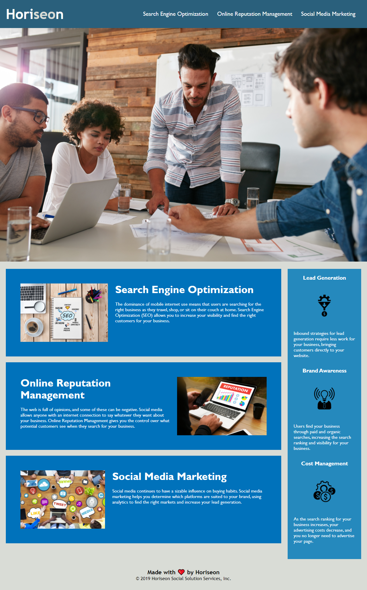

# Front Page of Horiseon Company Website - HTML & CSS Code Refactor Project

    

# This website is an example of what a front page of a company website with accessibility standards built in looks like.
# Using given html and css code, we were tasked with both modifying and creating code to bring accessibility to the webpage.
# the picture above shows a mockup of what the frontpage should look like. The header has both the company's name, with its own styling,
# and working links to each of the sub headings' descriptions below the main picture.
